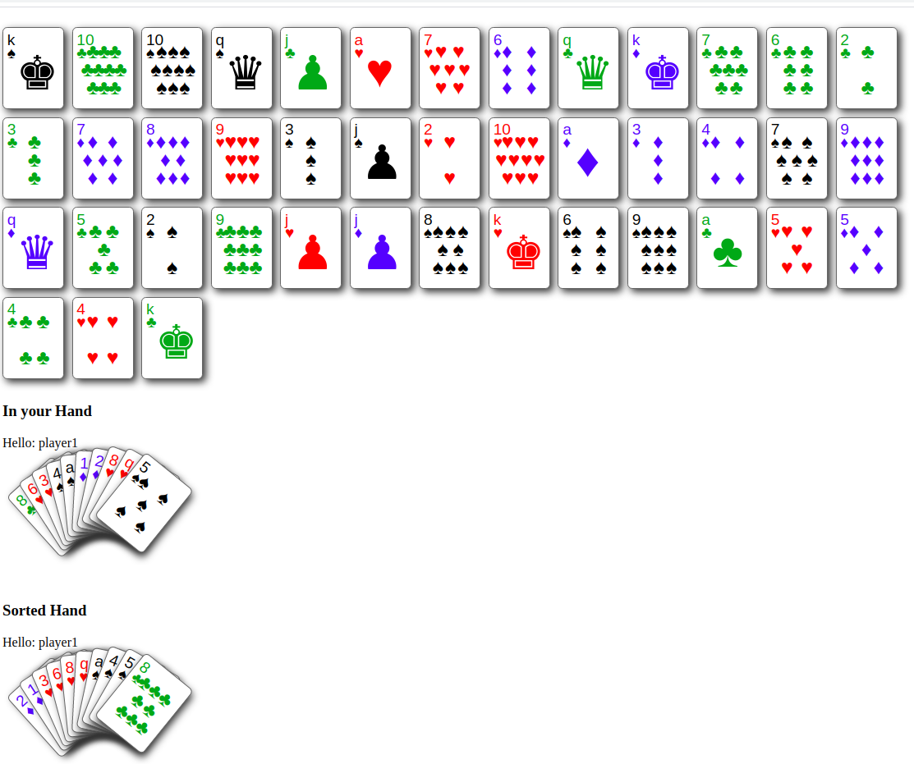

# atexoCardGame

Dans ce jeu, un joueur tire une main de 10 cartes tirées de manière aléatoire. Chaque carte possède une couleur ("Carreaux", par exemple) et une valeur ("10", par exemple). On vous demande de présenter la main "non triée" à l'écran puis la main triée. C'est-à-dire que vous devez classer les cartes par couleur et valeur. L'ordre des couleurs est, par exemple, le suivant :  --> Carreaux, Coeur, Pique, Trèfle L'ordre des valeurs est, par exemple, le suivant :  --> AS, 2, 3, 4, 5, 6, 7, 8, 9, 10, Valet, Dame, Roi

# Docker install

Install Docker with https://docs.docker.com/install/linux/docker-ce/ubuntu/

Install Docker Compose with https://docs.docker.com/compose/install/

Clone the git repo 
git@github.com:msfaxi/atexo.git

# Deploy
```
cd FrontCardGame && composer install
```
# For PHPUNIT test
cd FrontCardGame && ./vendor/bin/phpunit tests/

# To start game:
```
sudo docker-compose build; sudo docker-compose up -d
```

# Access game 
127.0.0.1:8081/game

# Game look like



# Credits
Code : MSF

img : CSS-Playing-Cards


